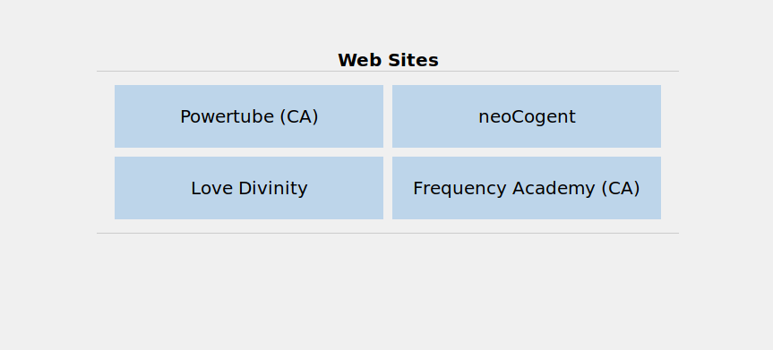

### gopanel - Multi-site Web Analytics Menu for goaccess

**gopanel** is a simple daemon that provides a site menu for [goaccess analytics](https://github.com/allinurl/goaccess) on multiple log files. It comes with all the pieces to add an admin page to an existing web site that allows you to choose which log file to view with realtime websocket based web stats. The realtime websocket is generated by goaccess but rather than having to manually run it for chosen log files it's all available through a web interface.

Here's a demo screen shot from one of my servers. You can edit the css or html to suit yourself. Clicking on one of the blue button starts goaccess realtime running and opens that page. Returning to menu (back) will kill the goaccess process to clean up.

gopanel comes with an example nginx file you can simply include on an existing site. It has example goaccess confs you can copy and edit for each menu entry (log file) you want to monitor. It magically scans the /etc/gopanel directory for these files and uses them to build a menu page. 

Right now gopanel only supports **one admin user** (non concurrent). I did structure it so I could soon add support for concurrent use but that depends on proxying a websocket for each so it's something I still need to figure out the nginx conf details on. 

#### How to Install and Use

For now use `git clone`, then commands as below. I will likely make a deb or pip package soon. 

As root,

- pip install Flask
- mkdir /etc/gopanel
- cp etc/site* /etc/gopanel/
- cp etc/gopanel.conf /etc/nginx
- cp etc/gopanel.service /lib/systemd/system/
- cp www/* /var/www/--your_site_location--/gopanel

Next, customize (for Ubuntu, as example):

- edit site conf files in /etc/gopanel, make one for each log file menu entry
- include the **gopanel.conf** provided by adding `include gopanel` in a web site's conf (edit to suit desired location)
- test the nginx conf with `nginx -t` before reloading it (conflicts can arise that need solving)
- use openssl or htpasswd to create a .htpasswd file for authentication (you can remove this and skip, but I'd suggest not)
- start the gopanel service with `systemctl start gopanel` and check it's status
- open your site gopanel location and test

You can use `systemctl status gopanel` for troubleshooting. The default install serves gopanel on localhost and is proxied by nginx for ssl connection through your existing site as this is probably how most admins would like to use it but it can be adapted to other methods.

If you have problems that you think are bugs then please post an issue so I can help / fix.

#### To Do 

- figure out nginx config for dynamic multi-websocket proxying to allow concurrent access
- add periodic goaccess call to get json output to add summary stats to menu items (pretty admin overview)
- possibly use wkhtmltox to capture analytics graph snapshots to use as menu item graphics
- umm, what else would be cool - please post an issue
